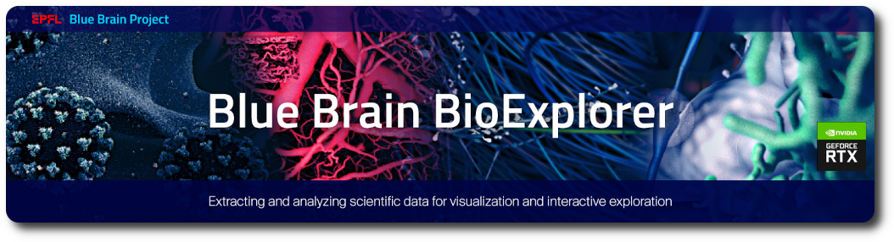

# Architecture



## Motivation

One of the keys towards seeing how the brain functions is representation of how the individual cells work. Specifically, the more morphologically precise the representation can be, the simpler it is for specialists in the organic field to approve cell structures; photograph reasonable rendering is accordingly significant.

The _BBBE_ is built as a plug-in of the [Blue Brain Brayns](https://github.com/BlueBrain/BioExplorer/tree/Brayns) platform, that can intelligently perform high-quality and high-fidelity rendering of large neuroscience datasets. Thanks to its client/server architecture, [Blue Brain Brayns](https://github.com/BlueBrain/BioExplorer/tree/Brayns) can be run in the cloud as well as on a supercomputer, and stream the rendering to any browser, either in a web UI or a Jupyter notebook. The challenges of neuroscience are numerous, but in the context of visualization at the Blue Brain Project, four objectives have to be reached: Large data sets, large displays, rendering performance and image quality.


As an academic institution, we also want to provide free software that can be run on virtually any type of architecture: CPUs, GPUs or virtual machines hosted in the cloud. In order to be used by a community as large possible, the target audience for [Blue Brain Brayns](https://github.com/BlueBrain/BioExplorer/tree/Brayns) includes developers, scientists, digital artists, and media designers.

## Design goals

[Blue Brain Brayns](https://github.com/BlueBrain/BioExplorer/tree/Brayns) is designed to address the challenges of visualizing large scale neuroscientific data (hundreds of thousands up to few millions of highly detailed neurons and Terabytes of simulation data). It has a research-oriented modular architecture that uses plug-ins, which makes it easy to experiment with novel rendering techniques, for instance trying to visualize neural electrical activity with signed distance fields.

This architecture is well-suited to address new use cases that are requested by scientists on a regular basis. [Blue Brain Brayns](https://github.com/BlueBrain/BioExplorer/tree/Brayns) has a client-server architecture allowing to run on a desktop PC, in the cloud or on a supercomputer. The core of [Blue Brain Brayns](https://github.com/BlueBrain/BioExplorer/tree/Brayns) currently provides two rendering engines, a CPU implementation built on top of Intel [OSPRay](https://github.com/ospray/ospray), and a GPU one based on [OptiX](https://developer.nvidia.com/rtx/ray-tracing/optix). [Blue Brain Brayns](https://github.com/BlueBrain/BioExplorer/tree/Brayns) provides an engine API that facilitates the integration of additional rendering engines.

[Blue Brain Brayns](https://github.com/BlueBrain/BioExplorer/tree/Brayns) has custom virtual cameras to support any type of display, for example cylindrical, omni-stereo panoramic and virtual reality setups. The rendered images can be streamed either to web browsers or large curved display walls. [Blue Brain Brayns](https://github.com/BlueBrain/BioExplorer/tree/Brayns) aims to be a platform for scientific visualization that makes it easy to add new scientific use-cases without having to worry about the complexity of the large scale rendering challenges. In the context of the Blue Brain Project:

-   Unified engine/platform as separate tools/applications increase the maintenance complexity
-   Unify common features like the loading of the data, and the building of the 3D scene
-   Focus on the the science, not on the engineering

As a general rule, engines do not need to have a similar set of functionalities, but implement what is necessary to serve the use-cases they are used for. Typically, the [OSPRay](https://github.com/ospray/ospray) implementation is used to render very large data sets, and the [OptiX](https://developer.nvidia.com/rtx/ray-tracing/optix) one runs the realtime immersive use-cases.

## Software Architecture

### Modular design

Modular design is a methodology that subdivides a framework into littler parts called modules, which can be freely made, changed, supplanted or traded between various frameworks. In the case of [Blue Brain Brayns](https://github.com/BlueBrain/BioExplorer/tree/Brayns), the philosophy is "Write code that is easy to replace, not easy to extend". In that context, modularity is at the component level. [Blue Brain Brayns](https://github.com/BlueBrain/BioExplorer/tree/Brayns) makes extensive use of the class factory pattern to create objects for the selected implementations.

The design was initially inspired by the [Sol-R](https://github.com/favreau/Sol-R) rendering engine that allows multiple engines ([CUDA](https://developer.nvidia.com/cuda-toolkit) and [OpenCL](https://www.khronos.org/opencl/)) to deliver interactive visualization of scientific data using the ray-tracing technique.

### Distributed architecture

In the context of large scale rendering, computation is usually distributed on many nodes, when the visualization and interaction with the system still has to be performed from a single machine. For that reason, [Blue Brain Brayns](https://github.com/BlueBrain/BioExplorer/tree/Brayns) is built upon a distributed architecture that allows all client components (python scripts, UI widgets, etc) to be run on separate machines.

### Abstraction

The abstraction layer defines the interface to every element that can be used by the various engines in the system. The abstraction was put at the lowest possible level where the compromise between execution speed and code duplication was found acceptable. Regarding the geometry, and for the sake of memory consumption, [Blue Brain Brayns](https://github.com/BlueBrain/BioExplorer/tree/Brayns) currently uses abstract data structures that are identical to the ones used by the underlying rendering engines ([OSPRay](https://github.com/ospray/ospray) and [OptiX](https://developer.nvidia.com/rtx/ray-tracing/optix)). This could vary in the future as new engines are added, but in this particular case of the geometry, and since it can be massive in the context of the Blue Brain project, the design decision was to force the engines to adapt to the definition of the abstract objects used by [Blue Brain Brayns](https://github.com/BlueBrain/BioExplorer/tree/Brayns).

### Properties

[Blue Brain Brayns](https://github.com/BlueBrain/BioExplorer/tree/Brayns) objects holding a list of properties that are mapped by name to a supported C++ type. This mechanism is used at every level of the software in order to facilitate the exposure of internal objects to the external API.

### Core components

#### Blue Brain Brayns

The initialization of the system involves command line parsing, engine creation, plug-in loading, data loading and setup of input devices. Command line parameters provide options about the application itself, the geometry and the renderer. [Blue Brain Brayns](https://github.com/BlueBrain/BioExplorer/tree/Brayns) creates the scene using built-in and plug-in provided loaders.

#### Parameter manager

The parameter manager manages all parameters registered by the application. By default, an instance of application, rendering, geometry and volume parameters are registered. The parameters managers offer the necessary methods to register any additional custom types of parameters.

#### Camera manipulators

Blue Brain Brayns provides two types of camera manipulators: Inspect and Fly. Inspect is the default, and allows the user to orbit around a target. The fly manipulator allows navigation in a flight simulator way.

#### Engine factory

The engine factory is in charge of instantiating engines according to their name.

#### Plug-ins

A plug-in is a set a functionalities that are not provided by the core of the application. For example, exposing a REST interface via HTTP, or streaming images to an distant display. Plug-ins are components external to the core that are dynamically loaded during the initialization process. [Blue Brain Brayns](https://github.com/BlueBrain/BioExplorer/tree/Brayns) accepts multiple iterations of the `plug-in` command line argument, followed by the name of the plug-in. The plug-in manager is in charge of loading and keeping track of the plug-ins for the lifetime of the application. At every iteration of the rendering loop, the `preRender` and `postRender` methods are respectively invoked before and after the rendering of the current frame, and this for every plug-in.

#### Data loaders

[Blue Brain Brayns](https://github.com/BlueBrain/BioExplorer/tree/Brayns) provides a default loader for meshes, proteins, volumes and point clouds.

#### Engine

The engine abstraction is a container for all components that make a rendering engine: A scene, a renderer, a set of lights, and a list of frame buffers. When adding a new engine to Blue Brain Brayns, those components have to be linked to the underlying corresponding ones provided by the 3rd party acceleration library, typically [OSPRay](https://github.com/ospray/ospray) or [OptiX](https://developer.nvidia.com/rtx/ray-tracing/optix), that provides the ray-tracing implementation.

An engine can have several renderers, cameras and frame buffers but only has one single scene. The engine is responsible for the creation of the components that it contains. For this, the engine provides a set of methods that have to be called by the individual implementations. Typically, `createCamera` creates the camera for the current engine, `createRenderer` creates the renderer and so on for every other component. The engine also provides statistics about the rendering speed of a frame via `getStatistics`.

#### Scene

A scene contains collections of geometries, materials and light sources that are used to describe the 3D scene to be rendered.

#### Model descriptor

The model descriptor defines the metadata attached to a model. Enabling a model means that the model is part of scene. If disabled, the model still exists in [Blue Brain Brayns](https://github.com/BlueBrain/BioExplorer/tree/Brayns), but is removed from the rendered scene. The visible attribute defines if the model should be visible or not. If invisible, the model is removed from the BVH. If set to true, the bounding box attribute displays a bounding box for the current model. Model descriptor are exposed via the HTTP/WS interface. The metadata structure is a simple map of strings that contains the name of a property and its value. This can be used to describe the model, with any piece of information that is relevant to the end user. The model descriptor manages instances of the model it contains via a list of transformations. The model descriptor provides functions to manage the metadata and the instances, to compute the bounds of the geometry, and access to the underlying model object.

#### Model

The model class holds the geometry attached to an asset of the scene (mesh, circuit, volume, etc). The model handles resources attached to the geometry such as implementation specific classes, and acceleration structures). Models provide a simple API to manipulate geometries (spheres, cylinders, cones, signed distance fields, triangle meshes, streamlines, etc), materials, a unique simulation handler, volumes and a unique transfer function. An [OSPRay](https://github.com/ospray/ospray) model holds two internal sets of geometries, a primary and a secondary one. The model is responsible for creating the materials attached to the geometry that it contains.

### Application Programming Interface

#### Action interface

The Action Interface allows developer to extend the API exposed via the network interface. It can register notifications, which have no return values with an optional parameter, and requests, which return a value after processing. The encoding of the parameter and return value is restricted to JSON.

#### plug-in

The plug-in interface defines the methods that need to be implemented by any new plug-in added to the list of components that [Blue Brain Brayns](https://github.com/BlueBrain/BioExplorer/tree/Brayns) can dynamically load. using the `--plug-in` command line argument, the name of the plug-in can be specified and [Blue Brain Brayns](https://github.com/BlueBrain/BioExplorer/tree/Brayns) will load the corresponding library at startup. A plug-in can access the engine, the action interface, the keyboard handler, and the camera manipulator provided by [Blue Brain Brayns](https://github.com/BlueBrain/BioExplorer/tree/Brayns).

Plug-ins can expose new external API, implement new data loaders, as well as shaders, cameras, geometries, materials, etc. plug-ins are also the place where use-case specific implementations are required. [Blue Brain Brayns](https://github.com/BlueBrain/BioExplorer/tree/Brayns) aims to remain agnostic to what it renders, plug-ins are responsible for giving a meaning to what is rendered.

#### Loader

In a research environment, new datasets appear on a daily basis, and being able to visualize them in a fast and easy way is crucial. [Blue Brain Brayns](https://github.com/BlueBrain/BioExplorer/tree/Brayns) offers an interface to data loaders so that custom implementations can easily be added to the system. Loaders are in charge of reading the data from external sources (IO, Databases, etc) and build the corresponding 3D scene via the creation of models. Loaders are asynchronous and run in a dedicated thread.

Loaders can define custom attributes via the property registration mechanism. `importFromBlob` and `importFromFile` are the two methods that need to be implemented in order for [Blue Brain Brayns](https://github.com/BlueBrain/BioExplorer/tree/Brayns) to accept the new loader. At runtime, the choice of the loaded is automatically determined by the extensions that it supports. If two loaders register the same extension, the priority matches to the loading order.

## Client software development kits

### Introduction

[Blue Brain Brayns](https://github.com/BlueBrain/BioExplorer/tree/Brayns) client SDKs are build on a dynamic approach, meaning that they are constructed according to the API exposed by the server, at runtime. Whenever a new end point is added to Blue Brain Brayns, the client SDK does not need to be adapted. Methods and data structures are automatically interpreted by the SDK and appear to the client application as Python or Javascript native objects. Client SDKs use the registry and schema end-points to list and define native and language-specific methods and data structures. As an example, the camera object appears in the registry (`/registry`) as follows:

```json
{"camera": ["PUT", "GET"]}
```

And the corresponding schema (`/camera/schema`):

```json
{"type":"object","properties":{"current":{"type":"string"},"orientation":{"type":"array","items":{"type":"number"},"minItems":4,"maxItems":4},"position":{"type":"array","items":{"type":"number"},"minItems":3,"maxItems":3},"target":{"type":"array","items":{"type":"number"},"minItems":3,"maxItems":3},"types":{"type":"array","items":{"type":"string"}}},"additionalProperties":false,"title":"Camera"}
```

### Python SDK

The Python SDK offers a simple and easy way to connect to [Blue Brain Brayns](https://github.com/BlueBrain/BioExplorer/tree/Brayns), using the following API:

```python
    from brayns import Client
    brayns = Client('host:port')
```

When this command is executed, and the SDK connected to a running instance of [Blue Brain Brayns](https://github.com/BlueBrain/BioExplorer/tree/Brayns), the end-point registry is parsed, and Python classes are built using an object wrapper for [JSON schema](https://python-jsonschema.readthedocs.io/en/stable/) definitions library. Methods of generated classes are JSON-RPC based. The Python call is no more than an invocation of a piece of code executed server-side.

This architecture allows the Python scripts to be run on light weight clients (mobile devices, laptop computers, etc) regardless of the size of the 3D scene which is handled by the server part of [Blue Brain Brayns](https://github.com/BlueBrain/BioExplorer/tree/Brayns). This also allows the server to be run in distributed mode. The generated Client class has a getter/setter method for every end points exposed by the [Blue Brain Brayns](https://github.com/BlueBrain/BioExplorer/tree/Brayns) server hat respectively has a GET/PUT method defined in the schema. For instance, the following code snippet illustrates how to manipulate a camera:

```python
  camera = brayns.get_camera()
  brayns.set_camera(position=(0,0,0), orientation=camera['orientation'])
```

### Javascript SDK

The Javascript SDK is collection of web apps and JavaScript packages for the C++ rendering service [Blue Brain Brayns](https://github.com/BlueBrain/BioExplorer/tree/Brayns).

### Deflect

Based on the data-parallel rendering feature provided by the [OSPRay](https://github.com/ospray/ospray) engine, the Deflect plug-in extends the `PixelOp` implementation to stream tiles from multiple nodes to [Tide](https://github.com/BlueBrain/Tide). Individual tiles are computed by rendering nodes, and sent to [Tide](https://github.com/BlueBrain/Tide) that is in charge of reconstructing the full frame and displaying it on the large screens. The deflect plug-in also processes input messages such as touches provided by Tide and implements the corresponding actions. Typically camera movements and the rendering options that are mapped to keyboard entries.

### Rockets

[Rockets](https://github.com/BlueBrain/Rockets) is a library for easy HTTP and websockets messaging in C++ applications. It provides HTTP server with integrated websockets support, HTTP client for making simple asynchronous requests, websocket client for sending, broadcasting and receiving text and binary messages, support for JSON-RPC as a communication protocol over HTTP and websockets. Rockets extends the 2.0 specification by providing support for cancellation and progress notifications of pending requests.

The Rockets plug-in allows [Blue Brain Brayns](https://github.com/BlueBrain/BioExplorer/tree/Brayns) to expose core and use-case specific API via HTTP or websocket protocols. The loading of the plug-in is initiated at startup time with the `http-server` command line argument where an optional host (default is localhost) and a mandatory port are specified. End-points are registered in the c++ code using the `registerNotification` or `registerRequest` method of the `ActionInterface` component. The list of registered end-points can be accessed via the `registry` end-point.

### VRPN

The VRPN plug-in receives events from input devices and transform them into [Blue Brain Brayns](https://github.com/BlueBrain/BioExplorer/tree/Brayns) usable information: Camera position and orientation, and fly stick interactions (position, orientation, joystick and buttons). This plug-in is mainly use for immersive setups.

## Applications

### Service

The service is an off-screen application that is typically used when running [Blue Brain Brayns](https://github.com/BlueBrain/BioExplorer/tree/Brayns) as a service in the cloud or in a supercomputer. This application does not require any kind of graphics acceleration when run with the [OSPRay](https://github.com/ospray/ospray) engine.

### Viewer

The viewer is an OpenGL based application that is used to run [Blue Brain Brayns](https://github.com/BlueBrain/BioExplorer/tree/Brayns) as a heavy client on a consumer PC.

## Use-cases

### Visualization of Blue Brain / Sonata datasets

The visualization of Blue Brain datasets requires a specific plug-in called the _BBBE_. This components allows the loading of the neuron , glial cells, or vasculatures, with a placement and orientation defined in the microcircuit description.


Cell morphologies can be represented in a simplified way using only a sphere for the somas, or meshed on the fly to offer a high quality rendering of dendrites and axons. The _BBBE_ also provides visualization of simulations by mapping the voltage values to the morphology geometry.


### MOOC

The Blue Brain Project provides a number of massive online courses in which students want to visualize micro-circuit structures and corresponding simulations. Since datasets can be large, running the visualization using client hardware and software resources is likely to give unacceptable results. Thanks to its client/server architecture, visualization can be processed server side on a virtual machine running in the cloud. Computed images are then streamed to the end client in real-time, allowing smooth navigation at a constant rate, regardless of the size of the dataset.


[Blue Brain Brayns](https://github.com/BlueBrain/BioExplorer/tree/Brayns) offers a CPU based renderer via its [OSPRay](https://github.com/ospray/ospray) engine that allows it to run efficiently on a GPU-free machine. Components used in this setup
are the following:

The current version of [Blue Brain Brayns](https://github.com/BlueBrain/BioExplorer/tree/Brayns) provides Docker images for the [user interface](https://hub.docker.com/r/bluebrain/brayns-ui) and [server-side components](https://hub.docker.com/r/bluebrain/brayns).


### OpenDeck

The OpenDeck is the Blue Brain visualization display for presentations and immersive exploration of scientific data in 3D.


#### Native rendering

The system consists of a semi-cylindrical screen measuring 8 by 3 meters, with a total pixel count of about 35 megapixels, 8 high-end Sony laser projectors (7 for the screen projection + 1 for the floor projection), 4 surround speakers, a microphone, 2 video conferencing cameras, 6 infrared LED tracking cameras to track user's head motion, an infrared touch interface, a cooling system to cool down the projectors, a Windows 10 PC from which the projectors, speakers, a microphone and a display cluster of 8 nodes, each one connected to a projector.

That immersive setup requires images to be delivered at a high frame rate (60 frames per seconds) and at a very high resolution (7x4K). Naturally, the choice of the engine goes in favor of the GPU implementation. Recent updates in the hardware such as NVIDIA's RTX technology dramatically improve the rendering speed. The drawback of such a setup being the size of the data that can be rendered, and advanced software solutions such as out-of-core and geometry streaming have to be implemented.


[Blue Brain Brayns](https://github.com/BlueBrain/BioExplorer/tree/Brayns) uses the GPU engine to achieve the performance required to avoid motion sickness. Three plug-ins are used on the server side: VRPN for position tracking and flight stick management, OpenDeck for stereoscopic cylindrical projection, and BioExplorer the loading and visualization of Blue Brain datasets.


#### Remote rendering

[Blue Brain Brayns](https://github.com/BlueBrain/BioExplorer/tree/Brayns) uses the CPU engine, and runs in distributed mode to visualize Blue Brain large datasets. Three plug-ins are used on the server side:
* VRPN for position tracking and flight stick management
* OpenDeck for stereoscopic cylindrical projection
* BioExplorer the loading and visualization of Blue Brain datasets.


Remote rendering focus gives more priority to size the dataset, and allows a lower frame rate than the native rendering setup. Visualization still has to be interactive, but does not have to be immersive. Thanks to [OSPRay](https://github.com/ospray/ospray)'s distributed mode [OSPRay](https://github.com/ospray/ospray), the CPU engine allows the rendering to be performed on multiple nodes. Each node is in charge of rendering a tile that is by default of size 64x64 pixels. Each node sends its tiles to [Tide](https://github.com/BlueBrain/Tide) using the [Deflect](https://github.com/BlueBrain/Deflect) library. [Tide](https://github.com/BlueBrain/Tide) is in charge of recomposing the final frame buffer and insures the synchronization of the display, which is usually driver by a cluster of several machines. [Tide](https://github.com/BlueBrain/Tide) offers two different surfaces, one for the main cylindrical screen and the other one for the floor projection. [Blue Brain Brayns](https://github.com/BlueBrain/BioExplorer/tree/Brayns) uses a specific camera that takes advantage of those surfaces to create a fully immersive visual experience.

The CPU engine uses the MPI distributed mode to render tiles on multiple nodes. Those tiles are sent to Tide via the Deflect client library [Deflect](https://github.com/BlueBrain/Deflect). [Tide](https://github.com/BlueBrain/Tide) is in charge of reconstructing the full frame and displaying the final image on the display.


## What next?

[Blue Brain Brayns](https://github.com/BlueBrain/BioExplorer/tree/Brayns) is currently the main platform used by the Blue Brain Project to visualize different types of data including morphologies, surface meshes and volumes. Currently, [Blue Brain Brayns](https://github.com/BlueBrain/BioExplorer/tree/Brayns) has plug-ins for visualizing simulated electro-physiological activity of point neuron and full compartmental models of large scale circuits up to the size of a mouse isocortex, diffusion tensor imaging data, large volumes.

The _BBBE_ application is built on top of a fork of [Blue Brain Brayns](https://github.com/BlueBrain/BioExplorer/tree/Brayns) 1.0.0 , the Blue Brain rendering platform. The _BBBE_ uses the underlying technical capabilities of the rendering platform to create large scale and accurate 3D scenes from Jupyter notebooks.

New developments will now focus on additional scientific use-cases, and new rendering engines ([Filament](https://github.com/google/filament) and [OptiX](https://developer.nvidia.com/rtx/ray-tracing/optix) 7.0).
