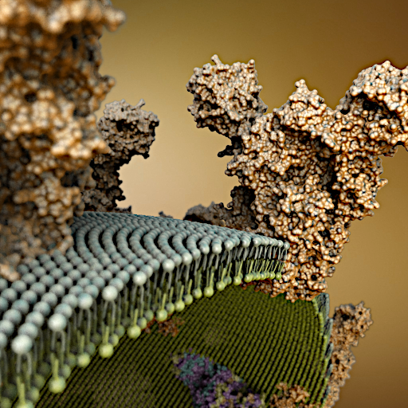

# BioExplorer plugin for Brayns

## Description
This module implements the visualization of biological resources

## Usage
- Point LD_LIBRARY_PATH to the folder which contains
  'libBioExplorer.so'
- Run Brayns application either with command line '--plugin BioExplorer'

## Screenshots

