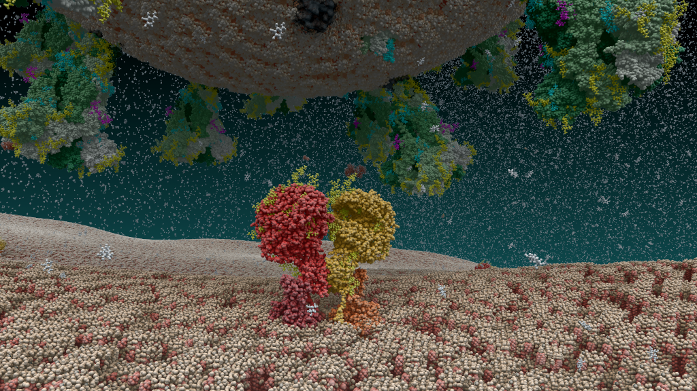
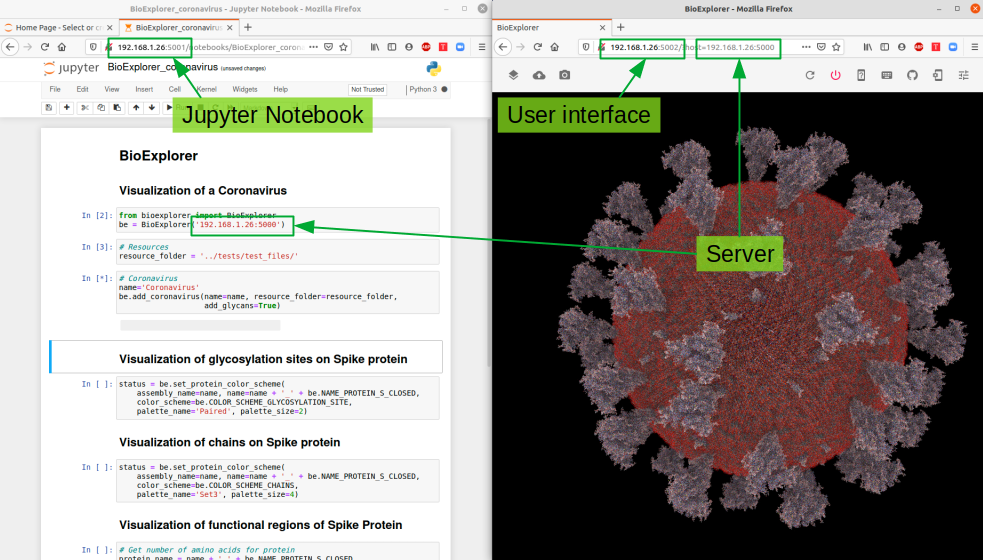

# BioExplorer

[](https://travis-ci.com/BlueBrain/BioExplorer)



## Description
The Blue Brain BioExplorer (_BBBE_) is a tool for scientists to extract and analyse scientific data from visualization. BBBE is built on top of [Blue Brain Brayns](https://github.com/BlueBrain/Brayns), the Blue Brain rendering platform.

## Architecture
The _BBBE_ application is built on top of Brayns, the Blue Brain rendering platform. The role of the application is to use the underlying technical capabilities of the rendering platform to create large scale and accurate 3D scenes from Jupyter notebooks.

## General components

### Assemblies
Assemblies are groups of biological elements, such as proteins, membranes, glycans, etc. 
As an example, a virion is made of a lipid membrane, spikes proteins, an RNA sequence, etc, and all those elements belong to the same object. That’s why they need to belong to the same container, the assembly.
Assemblies can have different shapes: Sphere, Cube, etc, that are automatically generated according to the parameters of individual
components.

### Proteins
Proteins are loaded from PDB files. Atoms, non-polymer chemicals and bonds can be loaded and displayed in various colour schemes: chain id, atom, residue, etc.
Proteins also contain the amino acid sequences of the individual chains. Sequences that can be used to query glycosylation sites, or functional regions of the protein.

### Meshes
Meshes are a set of triangles that can be loaded from OBJ files. This component is used for elements that can be represented as proteins.

### Glycans
Glycans are small proteins that are attached to an existing protein of the assembly. Individual glycan trees are loaded from PDB files and attached to the glycosylation sites of the specified protein. By default, glycans are attached to all available glycosylation sites, but a set of specific sites can be specified.

### RNA sequence
An RNA sequence can be loaded from a text sequence of codons.
Various shapes can be selected to represent the RNA sequence: Trefoil knot, torus, star, etc. This allows the sequence to be efficiently packed into a given volume. A different color is assigned per type of codon.

## Python SDK
A simple API if exposed via the _BBBE_ python library. The API allows scientists to easily create and modify assemblies, according the biological parameters. The _BBBE_ programming language is not necessarily reflecting the underlying implementation, but is meant to be as simple as close as possible to the language used by the scientists to describe biological assemblies.

## Deployment

BBBE binaries are publicaly available as docker images. BBE is designed to run in distributed mode, and is composed of 3 modules: A [server](https://hub.docker.com/r/bluebrain/bioexplorer), a [python SDK](https://hub.docker.com/r/bluebrain/bioexplorer-python-sdk), and a [web user interface](https://hub.docker.com/r/bluebrain/bioexplorer-ui). This means that there are 3 docker images to be downloaded on run. Those images can of course run on different machines.

In this example, we will expose the server on port 5000, the python SDK jupyter notebooks on port 5001, and the user inferface on port 5002. One is free to change those ports at will.

### Server

```bash
docker run -ti --rm -p 5000:8200 bluebrain/bioexplorer:0.7.0
```

### Python SDK

```bash
sudo docker run -ti --rm -p 5001:8888 bluebrain/bioexplorer-python-sdk:0.7.0
```

### Web User Interface

```bash
sudo docker run -ti --rm -p 5002:8080 bluebrain/bioexplorer-ui:0.7.0
```




## Simple example
Considering that the _BBBE_ server is running on the local host, on port 5000, the simplest example to visualize a coronavirus is:
```python
from bioexplorer import BioExplorer
be = BioExplorer('localhost:5000')
resource_folder = '../tests/test_files/'
name='Coronavirus'
be.add_coronavirus(name=name, resource_folder=resource_folder)
```

# License
_BBBE_ is available to download and use under the GNU General Public License ([GPL](https://www.gnu.org/licenses/gpl.html), or “free software”). The code is open sourced with approval from the open sourcing committee and principal coordinators of the Blue Brain Project in February 2021.

# Contact
For more information on _BBBE_, please contact:

__Cyrille Favreau__  
Senior Scientific Visualization Engineer  
Blue Brain Project  
[cyrille.favreau@epfl.ch](cyrille.favreau@epfl.ch) 

# Funding & Acknowledgment

The development of this software was supported by funding to the Blue Brain Project, a research center of the École polytechnique fédérale de Lausanne (EPFL), from the Swiss government’s ETH Board of the Swiss Federal Institutes of Technology.

COPYRIGHT 2020–2021, Blue Brain Project/EPFL
