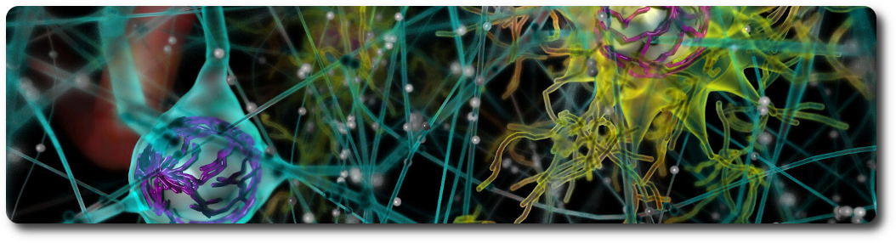
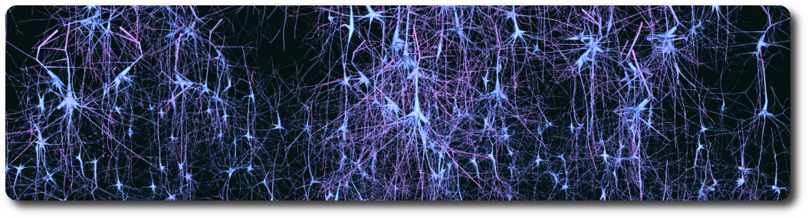
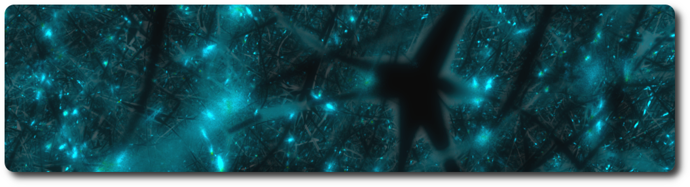
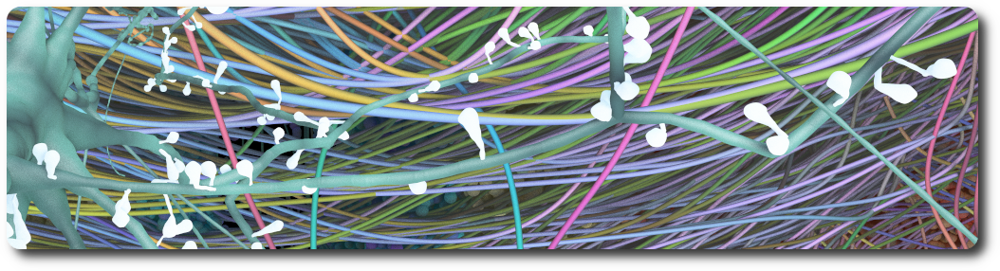

<!-- <link href="./bioexplorer/core/doc/extra.css" rel="stylesheet"></link> -->

# Blue Brain BioExplorer

<table border=0>
<tr>
  <td>
    <a href="https://github.com/BlueBrain/BioExplorer/tags">
    
    </a>
  </td>
  <td>
    <a href="https://github.com/BlueBrain/BioExplorer/blob/master/LICENSE.md">
    
    </a>
  </td>
	<td>
		<a href="https://github.com/BlueBrain/BioExplorer/forks">
		
		</a>
	</td>
  <td>
    <a href="https://github.com/BlueBrain/BioExplorer/stargazers">
    
    </a>
  </td>
  <td>
    <a href="https://github.com/BlueBrain/BioExplorer/network/members">
    
    </a>
  </td>
	<td>
		<a href="http://www.pydocstyle.org/">
		
		</a>
	</td>
	<td>
		<a href="https://pypi.org/project/pycodestyle/">
		
		</a>
	</td>
</tr>
</table>


## Description

Exploration relies on building software that combines data integration, analysis and interactive visualization to build, modify and navigate through large scientific datasets. For this, Blue Brain built and open-sourced the Blue Brain BioExplorer. The Blue Brain BioExplorer (BBBE), which started as an internal project, is now open source. It
was originally developed to answer key scientific questions related to the Coronavirus as a use case and to deliver a visualization tool. Today, the BioExplorer allows to reconstruct, visualize, explore and describe in detail the structure and function of highly-detailed biological structures such as molecular systems, neurons, astrocytes, blood vessels, and more. You can see the first application of the BioExplorer in '[A Machine-Generated View of the Role of Blood Glucose Levels in the Severity of COVID-19](https://www.frontiersin.org/articles/10.3389/fpubh.2021.695139/full?utm_source=fweb&utm_medium=nblog&utm_campaign=ba-sci-fpubh-covid-19-elevated-blood-glucose-blue-brain)' study, and see the SARS-COV-2 coronavirus as you have never seen it before by clicking on the following image!

<div align="center">
      <a href="https://youtu.be/Czn-YGLGfiA"/>
         
      </a>
</div>

On the third anniversary of the first lock-down, we look back at how #MachineLearning helped reveal the role of blood glucose levels in the severity of COVID-19. Imagine what else could be tackled with OpenScience.

<div align="center">
      <a href="https://lnkd.in/e57vqgcq"/>
         
      </a>
</div>

## BioExplorer goes RTX!

Thanks to its [NVIDIA OptiX](https://developer.nvidia.com/rtx/ray-tracing/optix) 6.5 backend compatibility, the BioExplorer can now take full advantage of the NVIDIA RTX acceleration hardware capabilities to deliver extremely fast and high-quality rendering of scientific datasets.

Simply add the OptiX engine command line argument when starting the BioExplorer.
```bash
braynsService --engine optix6 --plugin BioExplorer
```

Note that, in order to offer the best experience on local desktops, the BioExplorer now also has a native viewer.
```bash
braynsViewer --engine optix6 --plugin BioExplorer
```

## At the museum

July 2022: The EPFL Blue Brain Project is featuring in the exciting [Brain(s) exhibition](https://www.cccb.org/en/exhibitions/file/brains/237851) at the Barcelona Centre of Contemporary Culture at the Fundación Telefónica Madrid.


The Blue Brain images on show were created with the _BBBE_. Checkout the [news article](https://actu.epfl.ch/news/blue-brain-images-on-show-at-the-brains-exhibition/) for more information.


## Architecture

The _BBBE_ application is built on top of a fork of [Blue Brain Brayns](https://github.com/BlueBrain/BioExplorer/tree/Brayns) 1.0.0 , the Blue Brain rendering platform. The _BBBE_ uses the underlying technical capabilities of the rendering platform to create large scale and accurate 3D scenes from Jupyter notebooks.


More information can be found in the [architecture](./ARCHITECTURE.md) documentation.

## General components

### Assemblies

Assemblies are groups of biological elements, such as proteins, membranes, glycans, etc. As an example, a virion is made of a lipid membrane, spikes proteins, an RNA sequence, etc, and all those elements belong to the same object. That’s why they need to belong to the same container, the assembly. Assemblies can have different shapes: Sphere, Cube, etc, that are automatically generated according to the parameters of individual components.

### Proteins

Proteins are loaded from PDB files. Atoms, non-polymer chemicals and bonds can be loaded and displayed in various color schemes: chain id, atom, residue, etc.
Proteins also contain the amino acid sequences of the individual chains. Sequences that can be used to query glycosylation sites, or functional regions of the protein.


### Glycans

Glycans are small proteins that are attached to an existing protein of the assembly. Individual glycan trees are loaded from PDB files and attached to the glycosylation sites of the specified protein. By default, glycans are attached to all available glycosylation sites, but a set of specific sites can be specified.

Glycan trees models located in the python sdk test folder were generated with [Glycam Builder](http://glycam.org).


### RNA sequence

An RNA sequence can be loaded from a text sequence of codons. Various shapes can be selected to represent the RNA sequence: Trefoil knot, torus, star, etc. This allows the sequence to be efficiently packed into a given volume. A different color is assigned per type of codon.

### Mesh-based membranes

Mesh-based membranes create membranes based on 3D meshes. This allows the construction of complex membranes where mesh faces are filled with proteins.

### Virus

A viral particle is an assembly consisting of a membrane, an RNA sequence, and a given number of S, M and E proteins. The virus has a predefined spherical shape defined by its radius. The default parameters for the virus are a radius of 45 nanometers, 62 S proteins, 42 E proteins, and 50 M proteins. Dimensions and concentrations were retrieved from the literature.


### Membrane

A membrane is an assembly of phospholipids. Phospholipids structures are created following the process described in the [VMD](https://www.ks.uiuc.edu/Research/vmd) Membrane Proteins [tutorial](http://www.ks.uiuc.edu/Training/Tutorials). The assembly itself is generated by the BioExplorer, for a given shape, and a number of instances of phospholipids.


### Vasculature

Vasculatures are loaded from the database (see the database [schema](./storage/database/vasculature_schema.sql) and the example [notebook](./bioexplorer/pythonsdk/notebooks/vasculature/BioExplorer_import_sonata_to_db.ipynb) for loading data from [Sonata](https://github.com/AllenInstitute/sonata) files). A vasculature is defined by the blood vessels or arrangement of blood vessels in an organ or part.

```python
vasculature_model = bio_explorer.add_vasculature(
    assembly_name='Vasculature', population_name='vasculature', use_sdf=True)
```


An example dataset can be downloaded from the [Blue Brain Neuro-Glia-Vasculature Portal](https://bbp.epfl.ch/ngv-portal/anatomy/experimental-data/)

References:
* [Brain microvasculature has a common topology with local differences in geometry that match metabolic load](https://www.cell.com/neuron/fulltext/S0896-6273(21)00080-5?_returnURL=https%3A%2F%2Flinkinghub.elsevier.com%2Fretrieve%2Fpii%2FS0896627321000805%3Fshowall%3Dtrue)
* [Blue Brain Neuro-Glia-Vasculature Portal. Vasculature. Reconstruction Data](https://bbp.epfl.ch/ngv-portal/#explore)

### Neurons

Circuits of neurons are loaded from the database (see the database [schema](./storage/database/neurons_schema.sql) and the example [notebook](./bioexplorer/pythonsdk/notebooks/neurons/BioExplorer_import_sonata_to_db.ipynb) for loading data from [Sonata](https://github.com/AllenInstitute/sonata) files) using their position and orientation. Each cell is composed of sections that form the axons and dendrites, as well as spines. Cell internals such as the nucleus and the mitochondria can be automatically generated, according to the data provided by the scientific literature. The _BBBE_ also implements procedural generation of varicosities along the axon, as well as myelin sheaths.

```python
neurons_model = bio_explorer.add_neurons(
    assembly_name='Neurons',
    population_name='neurons',
    use_sdf=True, load_synapses=True, generate_varicosities=True,
    generate_internals=True, generate_externals=False
)
```

An [example dataset](https://zenodo.org/record/6906785#.Ywym7tVBxH6) is available in the [Model of Rat Non-barrel Somatosensory Cortex Anatomy](https://www.biorxiv.org/content/10.1101/2022.08.11.503144v1) publication. Please refer to the documentation of the [Sonata](https://github.com/AllenInstitute/sonata) format for information on how to load and analyze the model. A [jupyter notebook](./bioexplorer/pythonsdk/notebooks/neurons/rat_non-barrel_somatosensory_cortex_anatomy/BioExplorer_rat_non-barrel_somatosensory_cortex_anatomy.ipynb) has been included with basic examples of how to explore the data using the Blue Brain open-source packages [NeuroM](https://neurom.readthedocs.io/en/stable/) and [Blue Brain SNAP](https://bluebrainsnap.readthedocs.io/en/stable/).

References:
* [A Model of Rat Non-barrel Somatosensory Cortex Anatomy](https://www.biorxiv.org/content/10.1101/2022.08.11.503144v1)
* [A simplified morphological classification scheme for pyramidal cells in six layers of primary somatosensory cortex of juvenile rats](https://www.sciencedirect.com/science/article/pii/S2451830118300293)
* [Age and sex do not affect the volume, cell numbers, or cell size of the suprachiasmatic nucleus of the rat: An unbiased stereological](https://doi.org/10.1002/cne.903610404)


### Astrocytes

Circuits of astrocytes are loaded from the database (see the database [schema](./storage/database/astrocytes_schema.sql) and the example [notebook](./bioexplorer/pythonsdk/notebooks/astrocytes/BioExplorer_import_sonata_to_db.ipynb) for loading data from [Sonata](https://github.com/AllenInstitute/sonata) files) using their position and orientation. Astrocytes end-feet are connected to the vasculature using data stored in a dedicated connectome database [schema](./storage/database/connectome_schema.sql). The _BBBE_ allows end-feet to automatically adapt to the vasculature vessel size.

```python
vasculature_model = be.add_astrocytes(
    assembly_name='Astrocytes', population_name='astrocytes', use_sdf=True)
```



The neurons assembly allows visualization of brain microcircuits. Morphologies imported from ASC, SWC or H5 files into the _BBBE_ database can be loaded an transformed in different ways: simple spheres or somas only, simple rendering of full morphologies using spheres, cones and cylinders, or advanced rendering of full morphologies using the [signed distance field](https://iquilezles.org/articles/distfunctions/) technique.

Multi-scale models of the rat and mouse brain integrate models of ion channels, single cells, microcircuits, brain regions, and brain systems at different levels of granularity (molecular models, morphologically detailed cellular models, and abstracted point neuron models). A neuronal microcircuit is the smallest functional ecosystem in any brain region that encompasses a diverse morphological and electrical assortment of neurons, and their synaptic interactions. Blue Brain has pioneered data-driven digital reconstructions and simulations of microcircuits to investigate how local neuronal structure gives rise to global network dynamics. These methods could be extended to digitally reconstruct microcircuits in any brain region.


In the nervous system, a synapse is a structure that permits a neuron (or nerve cell) to pass an electrical or chemical signal to another neuron. Synapses can be classified by the type of cellular structures serving as the pre- and post-synaptic components. The vast majority of synapses in the mammalian nervous system are classical axo-dendritic synapses (an axon connecting to a dendrite).


An example dataset is available on the [Blue Brain Neuro-Glia-Vasculature Portal](https://bbp.epfl.ch/ngv-portal/anatomy/experimental-data/)

References:
* [Thalamic control of sensory enhancement and sleep spindle properties in a biophysical model of thalamoreticular microcircuitry](http://biorxiv.org/lookup/doi/10.1101/2022.02.28.482273)
* [Computational synthesis of cortical dendritic morphologies](https://doi.org/10.1016/j.celrep.2022.110586)
* [Digital reconstruction of the neuro-glia-vascular architecture](https://doi.org/10.1093/cercor/bhab254)
* [Blue Brain Neuro-Glia-Vasculature Portal. Anatomy. Reconstruction Data](https://bbp.epfl.ch/ngv-portal/anatomy/reconstruction-data/)
* [The SONATA data format for efficient description of large-scale network models](https://journals.plos.org/ploscompbiol/article?id=10.1371/journal.pcbi.1007696)

* [Cortical cell assemblies and their underlying connectivity: an in silico study](https://www.biorxiv.org/content/10.1101/2023.02.24.529863v1)


### Simulation of neuronal activity

Using the NEURON simulation package, the circuit information is loaded from disk, instantiating the various cell models (morphologies with ion channel distribution) and synaptic connections. The experimenter selects a stimulus protocol which will inject electrical current into the network and increase the membrane voltages of cells. As cells approach a threshold current, they release an action potential (AP) which will then propagate additional current changes to other cells via the synapses' release mechanisms. _BBBE_ loads the simulation reports generated by NEURON and maps the voltages to the corresponding segments of the morphologies. A transfer function defines the mapping between a color and a voltage value.

### Morphology synthesis

The goal of [computational synthesis of cortical dendritic morphologies](https://www.sciencedirect.com/science/article/pii/S2211124722003308) is to be able to generate an arbitrary number of neurons (and also other cells, such as glia) that can be subsequently used in various types of simulation. Part of this goal is to recreate in the synthesized cells as many morphological features as possible.



The synthesis scheme is based on the assumption that it is necessary to know the environment within which the cells are growing in order to recreate them accurately. Neuronal morphologies are influenced both by the embedding space and the presence of other cells. Their axons may target certain regions or the dendrites may mass in one region to collect input, such as the apical tuft of pyramidal cells. It is important therefore to synthesize the cells within biologically accurate volumes.

### Proximity detection

In the context of brain simulation, detecting touches between neurons is a essential part of the process. The _BBBE_ provides a renderer that computes the distance between the geometries in the 3D scene.



When a ray hits a geometry, a random secondary ray is sent in a direction belonging to an hemisphere defined by the normal to the surface. If that secondary ray hits another geometry, the distance between the initial hit and the new intersection is computed, and the corresponding color is assigned to the pixel. By default, red is for short distances (including touches), and green for longer ones. The notion of short and long is defined in the settings of the renderer.

### White matter

White matter is composed of bundles, which connect various grey matter areas (the locations of nerve cell bodies) of the brain to each other, and carry nerve impulses between neurons. Myelin acts as an insulator, which allows electrical signals to jump, rather than coursing through the axon, increasing the speed of transmission of all nerve signals.

A [Python notebook example](./bioexplorer/pythonsdk/notebooks/connectomics/BioExplorer_import_white_matter_allen_brain.ipynb) demonstrates how to download and import white matter streamlines from the [Allen Brain Institute website](https://alleninstitute.org) into the _BBBE_ database. Another [Python notebook](./bioexplorer/pythonsdk/notebooks/connectomics/BioExplorer_white_matter.ipynb) demonstrates how to visualize the streamlines with the _BBBE_.

```python
white_matter_model = be.add_white_matter(
    assembly_name='White matter',  population_name='connectome', radius=2.5)
```



References:
* [Allen Brain Institute: mouse connectivity projections](http://connectivity.brain-map.org/)
* [Allen Brain Institute: mouse connectivity atlas](https://alleninstitute.github.io/AllenSDK/connectivity.html)

The white matter feature contributed to generating images for the [null model of the mouse whole-neocortex micro-connectome](https://www.nature.com/articles/s41467-019-11630-x) publication and produce the corresponding movie.

<div align="center">
      <a href="https://www.youtube.com/watch?v=6cBNdAn04Qw"/>
         
      </a>
</div>


### Enzyme reactions

An enzyme attracts substrates to its active site, catalyzes the chemical reaction by which products are formed, and then allows the products to dissociate (separate from the enzyme surface). The combination formed by an enzyme and its substrates is called the enzyme–substrate complex. The _BBBE_ allows easy visualization of enzyme reactions by providing a substrate, a product, and a type of reaction (for example: [Hexokinase](./bioexplorer/pythonsdk/notebooks/molecular_systems/BioExplorer_enzyme_reaction.ipynb)).


References:
* [Blue Brain Neuro-Glia-Vasculature Portal. Metabolism. Reconstruction Data](https://bbp.epfl.ch/ngv-portal/#explore)

### Neuromodulation

Neuromodulation of neocortical microcircuits is one of the most fascinating and mysterious aspects of brain physiology. Despite over a century of research, the neuroscientific community has yet to uncover the fundamental biological organizing principles underlying neuromodulatory release. Phylogenetically, Acetylcholine (ACh) is perhaps the oldest neuromodulator, and one of the most well-studied. ACh regulates the physiology of neurons and synapses, and modulates neural microcircuits to bring about a reconfiguration of global network states. ACh is known to support cognitive processes such as learning and memory, and is involved in the regulation of arousal, attention and sensory processing. While the effects of ACh in the neocortex have been characterized extensively, integrated knowledge of its mechanisms of action is lacking. Furthermore, the ways in which ACh is released from en-passant axons originating in subcortical nuclei are still debatable. Simulation-based paradigms play an important role in testing scientific hypotheses, and provide a useful framework to integrate what is already known and systematically explore previously uncharted territory. Importantly, data-driven computational approaches highlight gaps in current knowledge and guide experimental research. To this end, I developed a multi-scale model of cholinergic innervation of rodent somatosensory cortex comprising two distinct sets of ascending projections implementing either synaptic (ST) or volumetric transmission (VT). The model enables the projection types to be combined in arbitrary proportions, thus permitting investigations of the relative contributions of these two transmission modalities. Using our ACh model, we find that the two modes of cholinergic release act in concert and have powerful desynchronizing effects on microcircuit activity. Furthermore we show that this modeling framework can be extended to other neuromodulators, such as dopamine and serotonin, with minimal constraining data. In summary, our results suggest a more nuanced view of neuromodulation in which multiple modes of transmitter release - ST vs VT - are required to produce synergistic functional effects.


References:
* [Neuromodulation of neocortical microcircuitry: a multi-scale framework to model the effects of cholinergic release](https://infoscience.epfl.ch/record/294819)
* [The cholinergic innervation develops early and rapidly in the rat cerebral cortex: a quantitative immunocytochemical study](https://www.sciencedirect.com/science/article/abs/pii/S030645220100389X)

## Python SDK

A simple API if exposed via the _BBBE_ python library. The API allows scientists to easily create and modify assemblies, according the biological parameters. The _BBBE_ programming language is not necessarily reflecting the underlying implementation, but is meant to be as simple as close as possible to the language used by the scientists to describe biological assemblies.

The _BBBE_ Python SDK is available on [pypi](https://pypi.org/project/bioexplorer/).

A large number of examples (as python notebooks) are provided in the [notebooks](https://github.com/BlueBrain/BioExplorer/tree/master/bioexplorer/pythonsdk/notebooks) folder.

## Documentation

See [here](https://bluebrain.github.io/BioExplorer/) for detailed documentation of the source code.

## Deployment

_BBBE_ binaries are publicly available as docker images. _BBBE_ is designed to run in distributed mode, and is composed of 3 modules: A [server](https://hub.docker.com/r/bluebrain/bioexplorer), a [python SDK](https://hub.docker.com/r/bluebrain/bioexplorer-python-sdk), and a [web user interface](https://hub.docker.com/r/bluebrain/bioexplorer-ui). This means that there are 3 docker images to be downloaded on run. Those images can of course run on different machines.

**Note:** The _BBBE_ is NOT a web application. It uses web technologies for the user interface but the _BBBE_ is a single session system that requires one back-end instance per user. There is no limitation in the number of user interface instances that can connect to the back-end, but they will all be sharing the same session.

In this example, we will expose the server on port 5000, the python SDK jupyter notebooks on port 5001, and the user interface on port 5002. One is free to change those ports at will.

### Server

```bash
docker run -ti --rm -p 5000:8200 bluebrain/bioexplorer
```

### Python SDK

```bash
docker run -ti --rm -p 5001:8888 bluebrain/bioexplorer-python-sdk
```

Note that a local folder can be specified to access personal notebooks:

```bash
docker run -ti --rm -p 5001:8888 -v <my_notebooks_folder>:/app/BioExplorer/notebooks bluebrain/bioexplorer-python-sdk
```

### Web User Interface

```bash
docker run -ti --rm -p 5002:8080 bluebrain/bioexplorer-ui
```

### PostgreSQL Database

A PostgreSQL Database can be created as a Docker image and used by the _BBBE_ as a storage component. More information on how to create and populate the database with sample datasets can be found in the dedicated [Docker Database documentation](./storage/database/DOCKER.md).


## Building from Source

### Blue Brain Brayns

In order to run the BioExplorer, it is necessary to build [Blue Brain Brayns](https://github.com/BlueBrain/BioExplorer/tree/Brayns) first.

### BioExplorer

#### Compile

With [Blue Brain Brayns](https://github.com/BlueBrain/BioExplorer/tree/Brayns) compiled and installed in the <brayns_installation_folder>, run the statements to build the BioExplorer.

```bash
git clone https://github.com/BlueBrain/BioExplorer.git
mkdir build
cd build
CMAKE_PREFIX_PATH=<brayns_installation_folder> cmake .. -DCMAKE_INSTALL_PREFIX=<brayns_installation_folder>
make install
```

#### Run

The BioExplorer being a plug-in for [Blue Brain Brayns](https://github.com/BlueBrain/BioExplorer/tree/Brayns), the following commands can be used to start the backend:

```bash
export LD_LIBRARY_PATH=<brayns_installation_folder>/lib:${LD_LIBRARY_PATH}
export PATH=<brayns_installation_folder>/bin:${PATH}
braynsService --http-server localhost:5000 --plugin BioExplorer
```

## Simple example

Considering that the _BBBE_ server is running on the local host, on port 5000, the simplest example to visualize a SARS-COV-2 coronavirus is:
```python
from bioexplorer import BioExplorer
be = BioExplorer('localhost:5000')
resource_folder = '../../tests/test_files/'
name='Coronavirus'
be.add_sars_cov_2(name=name, resource_folder=resource_folder)
```

# License

_BBBE_ is available to download and use under the GNU General Public License ([GPL](https://www.gnu.org/licenses/gpl.html), or “free software”). The code is open sourced with approval from the open sourcing committee and principal coordinators of the Blue Brain Project in February 2022.


# Contact

For more information on _BBBE_, please contact:

* [__Cyrille Favreau__](https://www.epfl.ch/research/domains/bluebrain/blue-brain/people/our-people/operations-division/cyrille-favreau/) - Senior Scientific Visualization Engineer - Blue Brain Project ([cyrille.favreau@epfl.ch](cyrille.favreau@epfl.ch))

* [__Emmanuelle Logette__](https://www.epfl.ch/research/domains/bluebrain/blue-brain/people/our-people/simulation-neuroscience-division/emmanuelle-logette/) - Scientific collaborator - Blue Brain Project ([emmanuelle.logette@epfl.ch](emmanuelle.logette@epfl.ch))

* [__Evelyne Schmid Osborne__](https://www.epfl.ch/research/domains/bluebrain/blue-brain/people/our-people/operations-division/evelyne-schmid-osborne/) - Communications - Blue Brain Project ([evelyne.schmidosborne@epfl.ch](evelyne.schmidosborne@epfl.ch))

# Funding & Acknowledgment

The development of this software was supported by funding to the Blue Brain Project, a research center of the École polytechnique fédérale de Lausanne (EPFL), from the Swiss government’s ETH Board of the Swiss Federal Institutes of Technology.

COPYRIGHT 2020–2023 Blue Brain Project/EPFL
