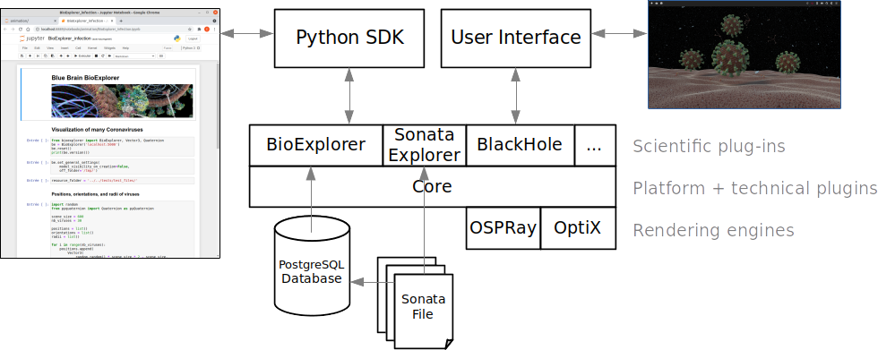
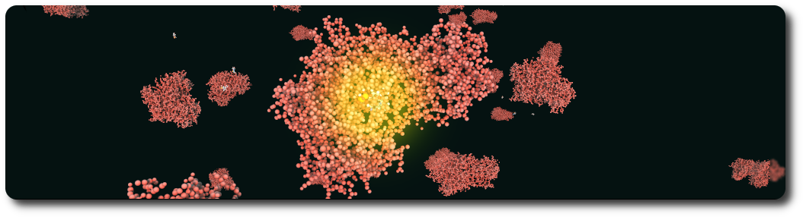

<link href="./bioexplorer/core/doc/extra.css" rel="stylesheet"></link>

# Blue Brain BioExplorer

<table border=0>
<tr>
  <td>
    <a href="https://github.com/BlueBrain/BioExplorer/tags">
    
    </a>
  </td>
  <td>
    <a href="https://github.com/BlueBrain/BioExplorer/blob/master/LICENSE.md">
    
    </a>
  </td>
	<td>
		<a href="https://github.com/BlueBrain/BioExplorer/forks">
		
		</a>
	</td>
  <td>
    <a href="https://github.com/BlueBrain/BioExplorer/stargazers">
    
    </a>
  </td>
  <td>
    <a href="https://github.com/BlueBrain/BioExplorer/network/members">
    
    </a>
  </td>
	<td>
		<a href="http://www.pydocstyle.org/">
		
		</a>
	</td>
	<td>
		<a href="https://pypi.org/project/pycodestyle/">
		
		</a>
	</td>
</tr>
</table>


## Description
In the context of the "[A Machine-Generated View of the Role of Blood Glucose Levels in the Severity of COVID-19](https://www.frontiersin.org/articles/10.3389/fpubh.2021.695139/full?utm_source=fweb&utm_medium=nblog&utm_campaign=ba-sci-fpubh-covid-19-elevated-blood-glucose-blue-brain)" study, the Blue Brain BioExplorer (_BBBE_) started as an internal project with the aim to answer key scientific questions related to the Coronavirus as a use case. This project aimed to deliver a visualization tool, the BioExplorer, to reconstruct, visualize, explore and describe in detail the structure and function of highly-detailed biological structures such as molecular systems, neurons, astrocytes, blood vessels, and more.

Check out the movie by clicking on the following image, and see the coronavirus as you have never seen it before!

<div align="center">
      <a href="https://youtu.be/Czn-YGLGfiA"/>
         
      </a>
</div>

## Architecture
The _BBBE_ application is built on top of a fork of [Blue Brain Brayns](https://github.com/BlueBrain/BioExplorer/tree/Brayns) 1.0.0 , the Blue Brain rendering platform. The _BBBE_ uses the underlying technical capabilities of the rendering platform to create large scale and accurate 3D scenes from Jupyter notebooks.



## General components

### Assemblies
Assemblies are groups of biological elements, such as proteins, membranes, glycans, etc. 
As an example, a virion is made of a lipid membrane, spikes proteins, an RNA sequence, etc, and all those elements belong to the same object. That’s why they need to belong to the same container, the assembly.
Assemblies can have different shapes: Sphere, Cube, etc, that are automatically generated according to the parameters of individual
components.

### Proteins
Proteins are loaded from PDB files. Atoms, non-polymer chemicals and bonds can be loaded and displayed in various colour schemes: chain id, atom, residue, etc.
Proteins also contain the amino acid sequences of the individual chains. Sequences that can be used to query glycosylation sites, or functional regions of the protein.


### Glycans
Glycans are small proteins that are attached to an existing protein of the assembly. Individual glycan trees are loaded from PDB files and attached to the glycosylation sites of the specified protein. By default, glycans are attached to all available glycosylation sites, but a set of specific sites can be specified.

Glycan trees models located in the python sdk test folder were generated with [Glycam Builder](http://glycam.org).


### RNA sequence
An RNA sequence can be loaded from a text sequence of codons.
Various shapes can be selected to represent the RNA sequence: Trefoil knot, torus, star, etc. This allows the sequence to be efficiently packed into a given volume. A different color is assigned per type of codon.

### Mesh-based membranes
Mesh-based membranes create membranes based on 3D meshes. This allows the construction of complex membranes where mesh faces are filled with proteins.

### Virus
A viral particle (= “virus”) is an assembly consisting of a membrane, an RNA sequence, and a given number of S, M and E proteins. The virus has a predefined spherical shape defined by its radius. The default parameters for the virus are a radius of 45 nanometers, 62 S proteins, 42 E proteins, and 50 M proteins. Dimensions and concentrations were retrieved from the literature.


### Membrane

A membrane is an assembly of phospholipids. Phospholipids structures are created following the process described in the [VMD](https://www.ks.uiuc.edu/Research/vmd) Membrane Proteins [tutorial](http://www.ks.uiuc.edu/Training/Tutorials). The assembly itself is generated by the BioExplorer, for a given shape, and a number of instances of phospholipids.


### Vasculature
Vasculatures are loaded from the database (see the database [schema](./storage/database/vasculature_schema.sql) and the example [notebook](./bioexplorer/pythonsdk/notebooks/vasculature/BioExplorer_import_sonata_to_db.ipynb) for loading data from [Sonata](https://github.com/AllenInstitute/sonata) files). A vasculature is defined by the blood vessels or arrangement of blood vessels in an organ or part.


### Neurons and astrocytes
Circuits of neurons are loaded from the database (see the database [schema](./storage/database/neurons_schema.sql) and the example [notebook](./bioexplorer/pythonsdk/notebooks/neurons/BioExplorer_import_sonata_to_db.ipynb) for loading data from [Sonata](https://github.com/AllenInstitute/sonata) files) using their position and orientation. Each cell is composed of sections that form the axons and dendrites, as well as spines. Cell internals such as the nucleus and the mitochondria can be automatically generated, according to the data provided by the scientific litterature.

Circuits of astrocytes are loaded from the database (see the database [schema](./storage/database/astrocytes_schema.sql) and the example [notebook](./bioexplorer/pythonsdk/notebooks/astrocytes/BioExplorer_import_sonata_to_db.ipynb) for loading data from [Sonata](https://github.com/AllenInstitute/sonata) files) using their position and orientation. Astrocytes end-feet are connected to the vasculature using data stored in a dedicated connectome database [schema](./storage/database/connectome_schema.sql). The _BBBE_ allows end-feet to automtically adapt to the vasculature vessel size.

The _BBBE_ allows interaction with large and highly details circuits of neurons.


### Enzyme reactions
An enzyme attracts substrates to its active site, catalyzes the chemical reaction by which products are formed, and then allows the products to dissociate (separate from the enzyme surface). The combination formed by an enzyme and its substrates is called the enzyme–substrate complex. The _BBBE_ allows easy visualization of enzyme reactions by providing a substrace, a product, and a type of reaction (for example: [Hexokinase](./bioexplorer/pythonsdk/notebooks/assemblies/BioExplorer_enzyme_reaction.ipynb)).




## Python SDK
A simple API if exposed via the _BBBE_ python library. The API allows scientists to easily create and modify assemblies, according the biological parameters. The _BBBE_ programming language is not necessarily reflecting the underlying implementation, but is meant to be as simple as close as possible to the language used by the scientists to describe biological assemblies.

The _BBBE_ Python SDK is available on [pypi](https://pypi.org/project/bioexplorer/).

A large number of examples (as python notebooks) are provided in the [notebooks](https://github.com/BlueBrain/BioExplorer/tree/master/bioexplorer/pythonsdk/notebooks) folder.

## Documentation

See [here](https://bluebrain.github.io/BioExplorer/) for detailed documentation of the source code.

## Deployment

_BBBE_ binaries are publicaly available as docker images. _BBBE_ is designed to run in distributed mode, and is composed of 3 modules: A [server](https://hub.docker.com/r/bluebrain/bioexplorer), a [python SDK](https://hub.docker.com/r/bluebrain/bioexplorer-python-sdk), and a [web user interface](https://hub.docker.com/r/bluebrain/bioexplorer-ui). This means that there are 3 docker images to be downloaded on run. Those images can of course run on different machines.

**Note:** The _BBBE_ is NOT a web application. It uses web techonlogies for the user interface but the _BBBE_ is a single session system that requires one back-end instance per user. There is no limitation in the number of user interface instances that can connect to the back-end, but they will all be sharing the same session.

In this example, we will expose the server on port 5000, the python SDK jupyter notebooks on port 5001, and the user inferface on port 5002. One is free to change those ports at will.

### Server

```bash
docker run -ti --rm -p 5000:8200 bluebrain/bioexplorer
```

### Python SDK

```bash
docker run -ti --rm -p 5001:8888 bluebrain/bioexplorer-python-sdk
```

Note that a local folder can be specified to access personal notebooks:

```bash
docker run -ti --rm -p 5001:8888 -v <my_notebooks_folder>:/app/BioExplorer/notebooks bluebrain/bioexplorer-python-sdk
```

### Web User Interface

```bash
docker run -ti --rm -p 5002:8080 bluebrain/bioexplorer-ui
```


## Building from Source

### Blue Brain Brayns
In order to run the BioExplorer, it is necessary to build [Blue Brain Brayns](https://github.com/BlueBrain/BioExplorer/tree/Brayns) first.

### BioExplorer

#### Compile
With [Blue Brain Brayns](https://github.com/BlueBrain/BioExplorer/tree/Brayns) compiled and installed in the <brayns_installation_folder>, run the statements to build the BioExplorer.

```bash
git clone https://github.com/BlueBrain/BioExplorer.git
mkdir build
cd build
CMAKE_PREFIX_PATH=<brayns_installation_folder> cmake .. -DCMAKE_INSTALL_PREFIX=<brayns_installation_folder>
make install
```

#### Run

The BioExplorer being a plug-in for [Blue Brain Brayns](https://github.com/BlueBrain/BioExplorer/tree/Brayns), the following commands can be used to start the backend:

```bash
export LD_LIBRARY_PATH=<brayns_installation_folder>/lib:${LD_LIBRARY_PATH}
export PATH=<brayns_installation_folder>/bin:${PATH}
braynsService --http-server localhost:5000 --plugin BioExplorer
```

## Simple example
Considering that the _BBBE_ server is running on the local host, on port 5000, the simplest example to visualize a coronavirus is:
```python
from bioexplorer import BioExplorer
be = BioExplorer('localhost:5000')
resource_folder = '../../tests/test_files/'
name='Coronavirus'
be.add_coronavirus(name=name, resource_folder=resource_folder)
```

# License
_BBBE_ is available to download and use under the GNU General Public License ([GPL](https://www.gnu.org/licenses/gpl.html), or “free software”). The code is open sourced with approval from the open sourcing committee and principal coordinators of the Blue Brain Project in February 2022.


# Contact
For more information on _BBBE_, please contact:

__Cyrille Favreau__  
Senior Scientific Visualization Engineer  
Blue Brain Project  
[cyrille.favreau@epfl.ch](cyrille.favreau@epfl.ch) 

# Funding & Acknowledgment

The development of this software was supported by funding to the Blue Brain Project, a research center of the École polytechnique fédérale de Lausanne (EPFL), from the Swiss government’s ETH Board of the Swiss Federal Institutes of Technology.

COPYRIGHT 2020–2022 Blue Brain Project/EPFL
