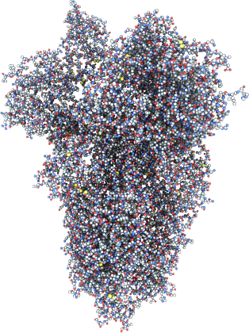
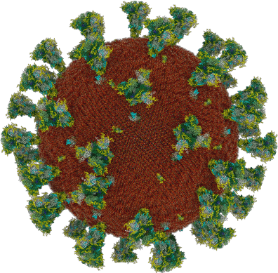
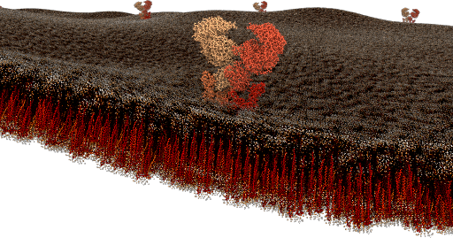
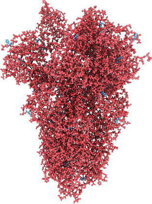
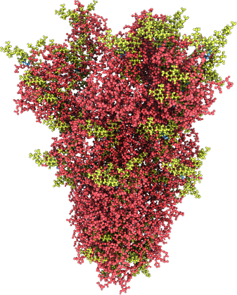
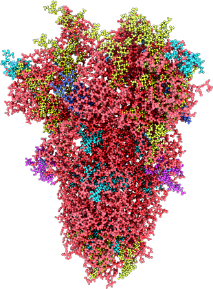
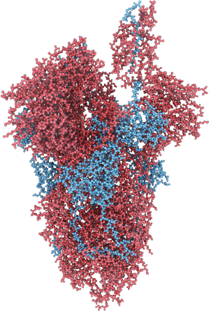
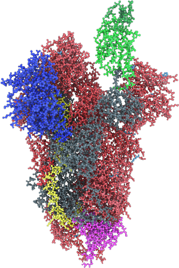

# User guide

## Protein
Proteins are loaded from PDB files. Atoms, non-polymer chemicals and bonds can be loaded and displayed in various colour schemes: chain id, atom, residue, etc.... Proteins also contain the amino acid sequences of the individual chains; these sequences can be used to query targeted sites (such as glycosylation sites), or functional regions of the protein.

```python
virus_protein_s = Protein(
    name='Spike',
    source='6vyb.pdb',
    number_of_instances=nb_protein_s,
    assembly_params=[11.5])
```



The Jupyter Python notebooks provide a simple and convenient way to create molecular systems. The BioExplorer exposes a number of primitives such as proteins or sugars, as well as complex systems like viruses or membranes. In the paragraph, we describe how to load and visualize a single protein, its glycosylation sites, and the glycans attached to them.

```python
from bioexplorer import BioExplorer, Protein
be = BioExplorer('localhost:5000')
ace2_receptor = Protein(sources=['6m1d.pdb'])
status = be.add_protein(
    name='ACE2 receptor', protein=ace2_receptor)
```

## Glycan
Glycans are small elements (branches of monosaccharides) that are attached to an existing protein of the assembly. Individual glycan trees are loaded from PDB files and attached to the glycosylation sites of the specified protein. By default, glycans are attached to all available glycosylation sites, but a set of specific sites can be specified.

```python
be.add_multiple_glycans(
    assembly_name=name, glycan_type=be.NAME_GLYCAN_HIGH_MANNOSE,
    protein_name=be.NAME_PROTEIN_S_CLOSED,
    paths=['high_mannose_glycan.pdb'])
```

## RNA sequence
An RNA sequence can be loaded from a text sequence of nucleotides. Various shapes can be selected to represent the RNA sequence: Trefoil knot, torus, star, etc….. This allows the sequence to be efficiently packed into a given volume. A different color is assigned per type of nucleotides.

## Membrane
A membrane is an assembly of phospholipids. Phospholipids structures are created following the process described in the VMD (https://www.ks.uiuc.edu/Research/vmd/) Membrane Proteins Tutorial (http://www.ks.uiuc.edu/Training/Tutorials/). The assembly itself is generated by the BioExplorer, for a given shape, and a number of instances of phospholipids.

```python
virus_membrane = Membrane(lipid_sources=['popc.pdb'])
```

## Surfactants
The BioExplorer exposes an API to help create 3D models of surfactants, according to given proteins for the branches and for the head.

```python
surfactant_a = Surfactant(
        name='Surfactant-A',
surfactant_protein=be.SURFACTANT_PROTEIN_A,
        head_source=surfactant_head_source,
        branch_source=surfactant_branch_source)

be.add_surfactant(
        surfactant=surfactant_a,
        representation=protein_representation,
        atom_radius_multiplier=protein_radius_multiplier,
        position=Vector3(), random_seed=2)
```


## Virus
A viral particle (= “virus”) is an assembly consisting of a membrane, an RNA sequence, and a given number of S, M and E proteins. The virus has a predefined spherical shape defined by its radius. The default parameters for the virus are a radius of 45 nanometers, 62 S proteins, 42 E proteins, and 50 M proteins. Dimensions and concentrations were retrieved from the literature (see list of dimensions and concentrations in appendix B2 and B3) 

```python
virus_protein_s = Protein(
    name='Spike',
    source='6vyb.pdb',
    number_of_instances=62,
    transmembrane_params=Vector2(10.5, 10.5)
)

virus_protein_e = Protein(
    name='E Protein',
    source='QHD43418a.pdb',
    number_of_instances=42,
    transmembrane_params=Vector2(0.5, 2.0)
)

virus_protein_m = Protein(
    name='M Protein',
    source='QHD43419a.pdb',
    number_of_instances=50,
    transmembrane_params=Vector2(0.5, 2.0)
)

virus_membrane = Membrane(lipid_sources=['popc.pdb'])

rna_sequence = RNASequence(
    source='sars-cov-2.rna',
    shape=be.RNA_SHAPE_TREFOIL_KNOT,
    shape_params=[11.0, 0.5],
    values_range=Vector2(0, 30.5 * math.pi),
    curve_params=Vector3(1.51, 1.12, 1.93)
)

virus_cell = Cell(
    name='coronavirus',
    shape=be.ASSEMBLY_SHAPE_SPHERE,
    shape_params=shape_params, membrane=virus_membrane,
    proteins=[virus_protein_s, virus_protein_e, virus_protein_m])

bio_explorer.add_cell(cell=virus_cell)

```

In order to ease the process of creating 3D detailed representations of viruses, an advanced API function with the default coronavirus parameters is provided by the BioExplorer:

```python
be.add_coronavirus(
    name='Coronavirus', resource_folder=resource_folder,
    representation=be.REPRESENTATION_ATOMS,
    add_glycans=True)
```


## Host cell
A host cell is an assembly composed of a membrane of a given size and shape (cylindric, sinusoidal, ect), and a given number of ACE2 receptors.

```python
ace2_receptor = Protein(
    name='ACE2',
    sources='6m1d.pdb', number_of_instances=20,
    transmembrane_params=Vector2(0.5, 2.0)
)

membrane = Membrane(lipid_sources=['popc.pdb'])

host_cell = Cell(
    name='Host cell',
    shape=be.ASSEMBLY_SHAPE_SINUSOIDAL,
    shape_params=Vector3(20.0, 20.0, 20.0),
    membrane=membrane,
    proteins=[ace2_receptor]
)
```



## Glycans Models
Glycan trees models are retrieved from Glycam Builder (http://glycam.org/Pre-builtLibraries.jsp). Only one exemplar of each type of glycan (HM, C, Hy and O-type) is represented in the current reconstruction and listed in appendix C1. 
Glycosylation sites can be visualized by applying a specific color scheme (COLOR_SCHEME_GLYCOSYLATION_SITE) to the protein.

```python
status = be.set_protein_color_scheme(
    assembly_name=name, name=name,
    color_scheme=be.COLOR_SCHEME_GLYCOSYLATION_SITE,
    palette_name='Set1', palette_size=2)
```


Glycosylation sites are automatically identified according to the amino acids sequence. When a N is found in the sequence, a glycosylation site exists if the next amino acid in the sequence is a not a P, and the following one is a T or a S.

Using that simple algorithm, glycans trees can be added to the Protein object. Glycans make use of a generic python object called Sugars. By providing the name of the assembly and the target protein, the BioExplorer automatically adds the Glycans to the identified glycosylation sites.

```python
glycan_name = name + '_Complex'
glycans = Sugars(
    assembly_name=name, protein_name=name, 
    name=glycan_name, source='10.pdb')
Status = be.add_glycans(glycans)
```


Multiple types of glycan trees can be also added to the Protein object, for specific glycosylation sites.

```python
high_mannose_glycans = Sugars(
    site_indices=[80, 141, 253], ...)
status = be.add_glycans(high_mannose_glycans)
complex_glycans = Sugars(
    site_indices=[36, 93, 168], ...)
status = be.add_glycans(complex_glycans)
```


## Visualization

A specific site or an amino-acid sequence can be visualized on the protein by providing a range of indices, and applying a specific color scheme (COLOR_SCHEME_AMINO_ACID_SEQUENCE) to the protein.

```python
status = be.set_protein_amino_acid_sequence_as_range(
    assembly_name=name, name=name, amino_acid_range=[500,750])
status = be.set_protein_color_scheme(
    assembly_name=name, name=name,
    color_scheme=be.COLOR_SCHEME_AMINO_ACID_SEQUENCE,
    palette_name='Set1', palette_size=2)
```


A specific site or an amino-acid sequence can also be specified by substring of the sequence, and applying a specific color scheme (COLOR_SCHEME_AMINO_ACID_SEQUENCE) to the protein.

```python
aa_sequence = 'ANNCTFEYVSQPFLMDLEGKQGNFKNLREFVFKNIDGYFKIYSKHTPINLVRD'

status = be.set_protein_amino_acid_sequence_as_string(
    assembly_name=name, name=name, amino_acid_sequence=aa_sequence)

status = be.set_protein_color_scheme(
    assembly_name=name, name=name,
    color_scheme=be.COLOR_SCHEME_AMINO_ACID_SEQUENCE,
    palette_name='Set1', palette_size=2)
```


Functional regions of a protein can be visualized by providing the indices of the regions in the amino acids sequence, and applying a specific color scheme (COLOR_SCHEME_REGIONS) to the protein.

```python
region_indices_and_colors = [
    [1, grey], [16, blue], [306, grey], [330, green],
    [438, dark_green], [507, green], [522, grey], [816, red],
    [835, grey], [908, yellow], [986, grey], [1076, cyan],
    [1274, grey], [2000, grey ]]
status = be.set_protein_color_scheme(
    assembly_name=name, name=name,
    color_scheme=be.COLOR_SCHEME_REGION, palette=palette)
```


